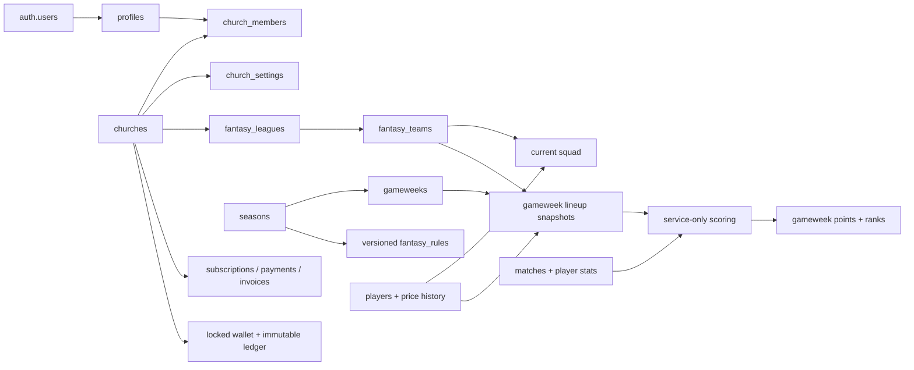

# Database architecture

`new database fantasy.pdf` is the immutable before snapshot. Migrations are the deployable source of truth.

## Tenant and authorization model

| Resource | Anonymous | Member/owner | Church admin | Super admin/service |
|---|---|---|---|---|
| Active church directory/settings | Read public fields | Read | Manage own settings | Global manage |
| Membership | None | Read own; join active church as member | Manage own church via RPC | Global |
| Public league | Read policy permits | Read/join and create one team | Own-tenant administration | Global |
| Private league | No UUID-only access | Invite authorization/participant | Own tenant/creator | Global |
| Current Fantasy team/squad | None | Owner only | No implicit player-state write | Super admin read; writes still controlled |
| Locked historical lineup/points | None | Same-league read after lock | Same | Scoring service writes |
| Ads | Active rows readable | — | Draft/submit/pause own tenant | Review/activate/reject |
| Billing/wallet | None | None | Read own tenant | Service writes; super admin reads |
| Audit logs | None | None | Read own tenant | Trusted functions append |

All `SECURITY DEFINER` functions use an empty search path and schema-qualified references. Gameplay, payment, and wallet internals have no PUBLIC/anon/authenticated execute grant unless they are an explicitly documented client API.

## Application RPCs

- `join_church(church_id)` — forced member self-join for an active church.
- `manage_church_member(...)` — church-admin-only membership role/status changes with last-admin protection.
- `create_church(...)`, `update_church_profile(...)`, `set_church_status(...)` — protected church lifecycle/profile operations.
- `set_platform_role(...)` — super-admin-only, audited role management.
- `create_fantasy_league(...)`, `join_fantasy_league(code)` — secure league/invite workflow.
- `get_league_rules(...)`, `get_fantasy_team_rules(...)` — safe resolved rule configuration for UI validation.
- `create_fantasy_rule_version(...)` — validated, scoped rule replacement without rewriting locked history.
- `create_fantasy_team_with_squad(...)` — league lock, access/capacity/duplicate/rule/budget validation, and atomic insert.
- `save_lineup(...)` — owner/deadline/full-lineup/formation/captain/bench validation.
- `execute_transfer(...)` — owner/season/deadline/position/club/budget/rule validation and atomic squad/economic history update.
- `mark_notifications_read(...)` — ownership-preserving read-state update.
- `review_advertisement(...)` — platform moderation workflow.

Service-only operations are `lock_gameweek`, `finalize_gameweek`, `record_payment_event`, and `post_wallet_transaction`. Edge Functions authenticate a real super-admin JWT before invoking service-only gameweek operations.

## Fantasy lifecycle

1. An active global rule exists for a season; an active church rule can override it.
2. The client fetches resolved rules for guidance, but the database revalidates every mutation.
3. Team creation locks its league row, guaranteeing `max_members` under concurrency.
4. Current squads are private until the deadline. `lock_gameweek` validates each complete team and creates an immutable player-by-player snapshot with prices and the entire resolved rule object.
5. Transfers record purchase/sale/incoming prices, sequence number, points penalty, and rule snapshot.
6. Finalization calculates per-match points using each lineup's frozen rules, performs legal ordered automatic substitutions, applies captain/vice fallback, subtracts transfer penalties, ranks teams, and marks snapshots/aggregates finalized.
7. A service-role rerun deterministically recomputes corrections from the same snapshot and rules; ordinary users cannot rewrite history.

## Finance lifecycle

Payment webhooks call `record_payment_event` with a provider event ID and payload digest. The unique event and payment-provider references make retries harmless. Payment recording does not assume that subscription revenue should credit a church wallet; that business action must explicitly call `post_wallet_transaction` with its own idempotency key.

Wallet posting locks the wallet row, checks the retry key after the lock, validates currency/amount, refuses a negative result, applies the balance, writes `balance_after`, and appends an audit event. Ledger rows cannot be updated or deleted.

## Storage

- `avatars/{user_id}/...`: public read, owner write, 5 MB.
- `church-media/{church_id}/...`: public read, that church's admin write, 10 MB.
- `player-media/...`: public read, super-admin write, 5 MB.
- `ad-media/{church_id}/...`: public read, that church's admin write, 10 MB.

All buckets accept JPEG, PNG, or WebP only. Database workflow rules still control whether uploaded ad media becomes active.

## Testing and operations

Run `supabase db test` to execute `tests/001_security_and_integrity.sql`, then run `npm run build` and `npm run lint`. The SQL suite covers all requested attack classes, legitimate self-service flows, provider idempotency, wallet retry/overdraft behavior, and tenant isolation. Wallet concurrency is guaranteed by `SELECT ... FOR UPDATE` on the wallet row; production load testing should still issue parallel debit calls through the deployed API.

Operationally, validate legacy `NOT VALID` constraints after remediating reported rows, communicate automatically rotated legacy invite codes to league creators, retain audit/financial backups, and schedule database backups/PITR in the Supabase project.
